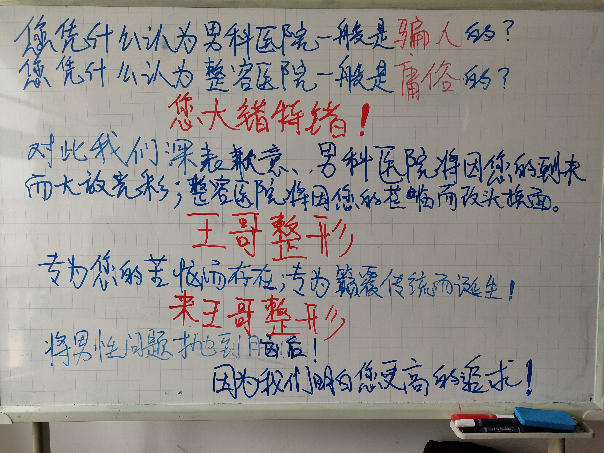

> 其实就是二锅头，兑的那个白开水。 -- 赵丽蓉，某小品

### 插播一条王哥医院的两则广告手稿

# 杀马特封闭系统

前两天去找老Y，我们坐在海边吃吃不完的流口水，我剥着糖纸对老Y说：等咱们中年了，哪天再聚，就不吃这种的啦！我会叫饭店上四盘剥好的流口水：一盘桃子味的，一盘葡萄味的，一盘橙子味的和一盘哈密瓜味的。不料我的思维被打破：我们身后的小广场有一辆改装得震天响的小宝马，花里胡哨的喷漆和土潮装饰。“杀马特，”老Y抱怨到，“你说他们这个样，头发四处发散，五颜六色，他们开车这样，开船什么样？”

“他们的船一定也是五颜六色的土潮改装，甲板左右肯定不对称，船锚是土壕金色的，救生圈上画的那种很俗气的大翅膀。然后我和你说，”我来劲了：“他们的汽笛都不是那种普通低沉的气笛，而是野狼DISCO的伴奏。不，说到这，我们必须把杀马特群体从现实中，从这个多元化的社会中剥离出来，因为你会发现这个群体满足封闭性，就比如我们不喜欢杀马特群体的存在；但同样，他们也不需要来自我们的认同感，也就是说井水不犯河水。因此剥离这个群体实际上并不是挖苦他们，而是把和他们对立的事物架空掉，剩下的就是单单的杀马特群体了。而在这个基础上，再把他们和我们融合到一起，构成的就是一种非现实但十分合理的荒诞景象。”

老Y似懂非懂地听着，他明白是因为他明白我没讲完，或者说他知道我嘴上说是要弄什么封闭系统，实际上还是表达一种厌恶感。但封闭系统是有的，我不打算停留在吐槽这个层面上。

“所以我跟你讲，他们的所到之处和我们是分开的，不信你看，他们的杀马特船经过的地方，海底的石头是粉色的，海底的沙是彩虹色的，海水是柠檬黄的，海浪声也是某个喊麦MC，每个漂浮的海草上面刻了一个箭穿心的图案。不光这些，他们的车，那个小宝马走的车道和我们都不一样，是那种鲜艳但是看起来很恶心的色调，红绿灯是带抖音滤镜的，交通牌上面画满了带刺的小玫瑰。但是啊你看多有意思，虽然如此不一样，由于我和他们不挨着，因此大家各自看各自的信号灯，各自处于各自的车道上，心满意足地生活着，悲欢离合来自与我们自身，不来自群体和群体之间的冲突。”

“在跟你说说社交软件，它们的微信图标是紫色的，上面两个气泡表情不是「··」而是「> <」，朋友圈里的图片如果没有豆豆鞋，过饱和的打扮和人民币中的一样，就是涉嫌违规；他们发的文字如果没有故意加上草字头，女字旁就会认定是低俗内容；而他们的头像一定不是正方形，而是不规则的多边形；公众号每次一定要抽奖送跑车。他们的支付宝图标是橙色的，上面的业务不是一排，而是不规则的、分布于屏幕的各个角落。”

“知乎呢？”

“知乎啊，噢，没区别，和我们看见的一模一样，豆瓣也是。”

老Y要笑死。

我们骂了一阵初中的语文老师。“其实这个老师不是给我们讲课的，她其实是杀马特的一员。当时她为什么觉得我们都不好？不是因为和我们有矛盾，其实她人应该挺好，只不过好声好气的精力全放在班里那些杀马特学生上。你以为我们和杀马特就不能共用某些符号吗？不，实际上正是由于我们证明了没有此语文老师也能考上高中，才发觉语文老师是一个冗余的符号；换句话说，我们初中没有语文老师，我们的成绩全是语文课代表在黑板布置作业和班主任高压统治的功劳。实际上那个语文老师看不见我们，我们也不知道真实的语文老师是怎样的形态；因此我们假装在听一个非杀马特在讲课，而一个杀马特在给自己的杀马特学生讲课。”

“不管怎样，我们都在自顾自往前走就是了；只不过，认同感让你和我能说上话，能让我们从初中一直聊到现在，来，老Y，吃流口水。这就是封闭系统，”我嚼着流口水：“所以没必要去嘲讽挖苦，因为是封闭的所以他们也听不进我的挖苦，因为是封闭的所以我也没必要生他们的气。如果说对立来自于误解，那我觉得嘲讽是拿不出手的。因此在嘲讽杀马特审美之前，必须承认这种审美的合理性，必须构建他们审美之下的整个世界；也就是说要理解他们，要热爱他们，要包容他们。”

“但他们还是太傻逼了啊！如果你能把他们全灭掉，你真不动手吗？”老Y问我。

“我操，那肯定一个也不剩啊！”

说罢我们大笑起来。

* [蜈蚣的屁股](posts/2020-05-14-ass.md) 2020-05
* [对影评的一些疑问](posts/2020-03-11-mreview.md) 2020-03
* [散文诗 20200213](posts/2020-02-13-v.md) 2020-020
* [买猪](posts/2020-02-09-pig.md) 2020-02
* [瘟疫公司](posts/2020-02-02-ncov.md) 2020-02
* [格利高里神父](posts/2020-01-05-hl2.md) 2020-01
* [花朵快快长](posts/2019-12-21-none.md) 2019-12
* [201Q年的一些经历和感想](posts/2019-11-30-q.md) 2019-11
* [An English Essay about English](posts/2019-11-english.md) 2019-11
* [Jupiter and Beyond the Infinite/木星以及超越一切苍穹](posts/2019-11-26-idx.md) 2019-11

#### [小王](index_wang.md)

#### [几首现代诗](index_mverse.md)

#### [Tech Spot](index_tech.md)

#### [几首当代诗（摘抄](contemporary/intro.md)

#### [豆瓣和空间的备份](index_history.md)

#### [计划](posts/plan.md)
